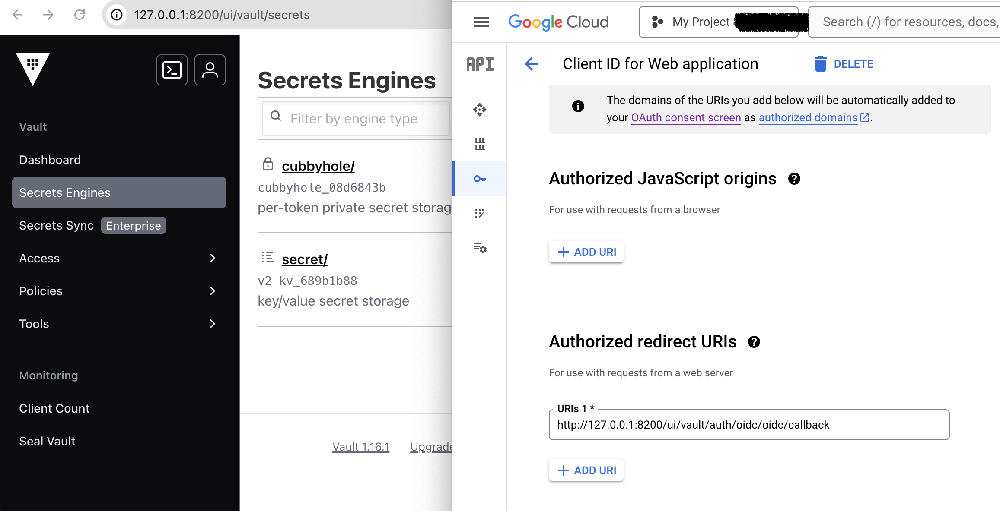
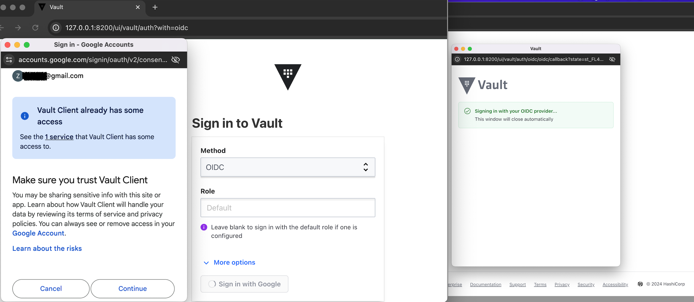
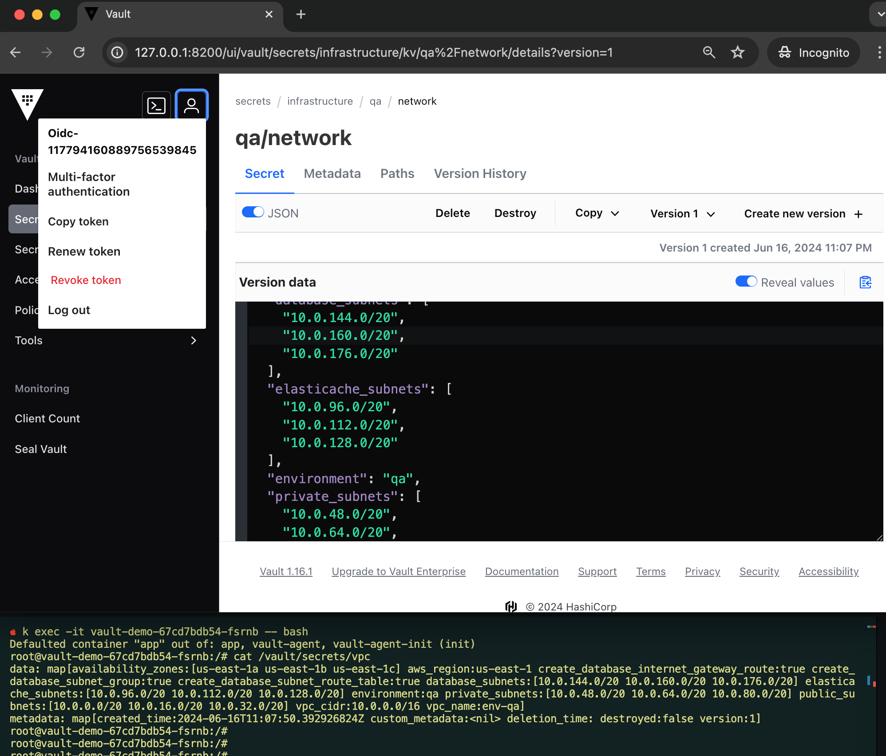

# Senario Brief

## This demo is about `Kubernetes` and `OIDC (gmail)` Auth methods in HashiCorp Vault

### 1. Spin up kubernetes and deploy `vault`
```bash
helm repo add hashicorp https://helm.releases.hashicorp.com
helm upgrade -i vault-dev hashicorp/vault -f values.yaml -n vault --create-namespace

# Create SA and Secret
echo 'apiVersion: v1
kind: ServiceAccount
metadata:
  name: vault-auth
  namespace: default
---
apiVersion: v1
kind: Secret
type: kubernetes.io/service-account-token
metadata:
  name: sa-secret
  namespace: default
  annotations:
    kubernetes.io/service-account.name: "vault-auth"' | kubectl apply -f-
```

### 2. Follow 1 to 19 [HashiCorp](https://developer.hashicorp.com/vault/tutorials/auth-methods/google-workspace-oauth#configure-google-workspace) and Port forward Vault
```bash
kubectl -n vault port-forward svc/vault-dev 8200:8200
```


### 3. Apply and test
```
# Modify `terraform.tfvars` file
terraform init
terraform apply --auto-approve

# Test secrets
echo 'apiVersion: apps/v1
kind: Deployment
metadata:
  labels:
    app: vault-demo
  name: vault-demo
  namespace: default
spec:
  replicas: 1
  selector:
    matchLabels:
      app: vault-demo
  template:
    metadata:
      labels:
        app: vault-demo
      annotations:
        vault.hashicorp.com/agent-inject: "true"
        vault.hashicorp.com/role: "local-k8s"                                       # KUBERNETES ROLE
        vault.hashicorp.com/agent-inject-secret-vpc: "infrastructure/qa/network"    # SECRETS PATH
        vault.hashicorp.com/service: http://vault-dev.vault:8200                    # VAULT_ADDR
        vault.hashicorp.com/auth-path: "auth/local-k8s"                             # KUBERNETES PATH
    spec:
      serviceAccountName: vault-auth
      containers:
      - image: "nginx"
        name: demo' | kubectl apply -f-
```



### 4. Cleanup backwards with (delete/destroy)